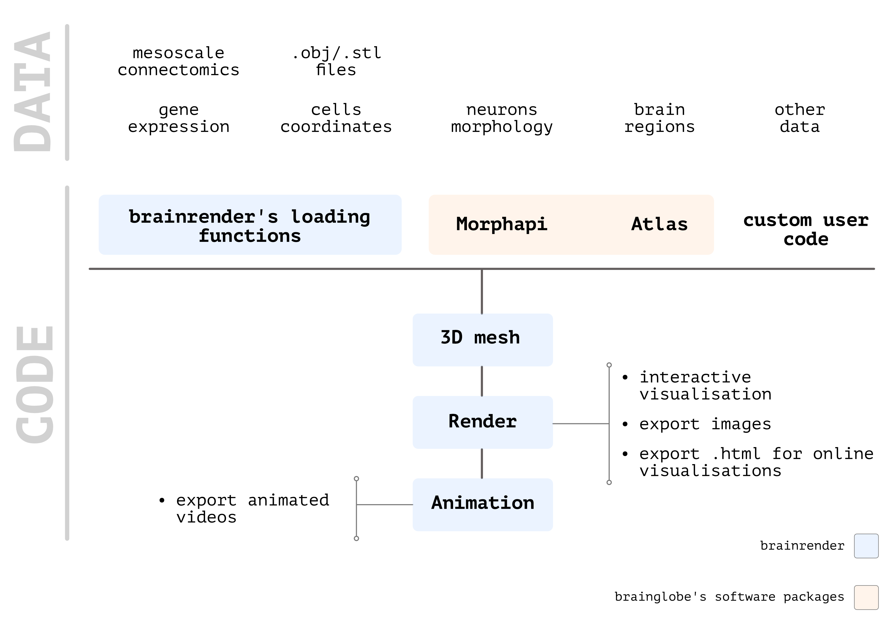

# Introduction


This documentation is for the **new brainrender 2.0**!

If  are getting started with brainrender, carry on. But if you have been using previous versions of the software, you might want to check t[he guide we've put together](usage/overview/v1-greater-than-v2.md) to transition to the new **brainrender**.



This section explains the logic behind how `brainrender` works. If you want more details about which classes/methods are part of each script, and what they do, check the automatically generated docs [here](autogenerated-docs/brainrender-autodocs/).


A core design goal is to facilitate the rendering of any data registered to a reference atlas. To this end, `brainrender` facilitates the creation of 3D objects from many different types of data \(e.g. cell locations, brain regions\) within minimal need for the development of dedicated code. In addition, `brainrender` is fully integrated with [BrainGlobe's atlasAPI](https://docs.brainglobe.info/bg-atlasapi/introduction) ensuring that you can use `brainrender` with any atlas supported by the API with no need for any changes in your code. 

The general **workflow** for any `brainrender` visualization consists of just a few steps:

1. **Load** your data and generate a `brainrender` `Actor`. This can be done using custom code, or with the [dedicated `Actor` classes ](usage/actors.md)provided by `brainrender` which can be used to render most types of data.
2. **Add** your data to a `brainrender`[ `Scene`](usage/scene-1/)\*\*\*\*
3. **Render** your scene, or use it to [create animated videos](usage/videos-animations-and-exporting-to-html.md). 

To learn more in detail how to use `brainrender`, keep reading this documentation and when you're ready check out the examples at the [GitHub repository](https://github.com/brainglobe/brainrender).

## Using Notebooks

`brainrender` can be used with Jupyter notebooks, but some care must be used when doing that. Find more details [here](usage/using-notebooks.md).

### Getting in touch

For any question, issue or bug report you can [get in touch](info/get-in-touch.md) on [the github repo](https://github.com/BrancoLab/BrainRender) or on [twitter](https://twitter.com/Federico_claudi).

#### Referencing brainrender

If you've found `brainrender` useful in your work, please cite `brainrender`'s publication\(s\). 

Check [here](info/referencing-brainrender.md) for more details. 

