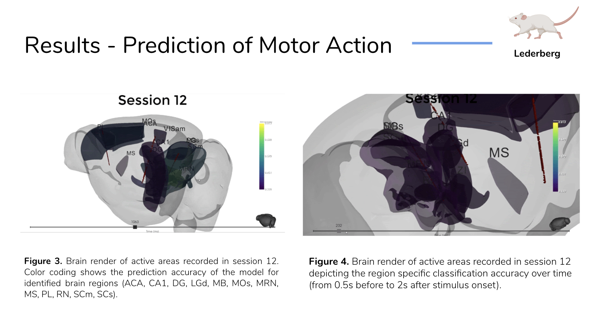

# User Cases

### Visualizing Decoder Accuracy

A group of students of [neuromatch academy](https://www.neuromatchacademy.org/) \(an open-source computational neuroscience summer school\) used `brainrender` to visualize the accuracy of the models they've build to decode movement from neural activity \([data from Steinmetz et al 2019](https://github.com/nsteinme/steinmetz-et-al-2019)\):

